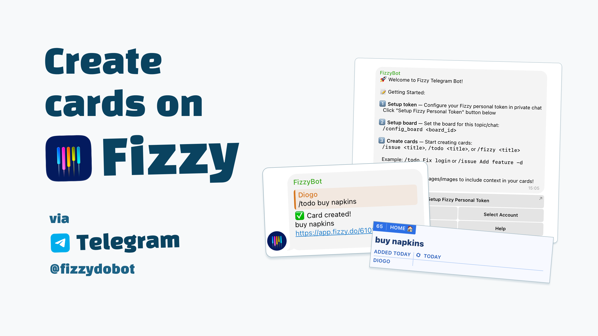

# Fizzy Telegram Bot

A Telegram bot that creates cards on [Fizzy](https://fizzy.do) directly from group/topic conversations.



## Features

- Multi-account support — Save multiple Fizzy accounts with friendly aliases like work, personal, etc
- Per-user personal Fizzy token (cards created under your name)
- Per-topic board configuration
- Interactive account selection per chat/group
- Supports `/issue`, `/todo`, and `/fizzy` commands to create cards
- Images embedded in card descriptions — Reply to an image and it's automatically included in the card description
- Optional custom description with `-d` when no reply
- Interactive inline menus with buttons for easy setup
- Status checking to see your current configuration

## Setup & Usage

### 1. Private Setup (Each User — Once)

Start a **private chat** with the bot and send `/start`.

Use the interactive menu:

- Click **"Setup Token"** → follow instructions to send:

```text
/config_token <alias> <account_slug> <personal_token>
```

The **alias** is a friendly name for your account (e.g., work, personal, friends).

Example:

```text
/config_token work 6942017 1XLafZsDEZLZsCSrCVPofTmL
/config_token personal 7131891 9XyZiBcDeFgH1JkLmN0PqRsT
```

- Click **"Check Status"** to see all your configured accounts
- Click **"Help"** for usage instructions

### 2. Group/Topic Setup

Add the bot to your group.

In each **topic** (or main chat for default), send:

```text
/config_board <board_id>
```

Example:

```text
/config_board 030140pir5f56
```

### 3. Create Cards

**First time in a group:**

- When you create your first card, the bot will show buttons with your saved accounts
- Select which account to use for this chat
- Auto-selection: If you only have one account configured, it automatically selects it for you!

**Creating cards:**

- **With context** (recommended): Reply to a message/photo:

  ```text
  /issue Fix login button
  ```

  → Description = replied content, images automatically embedded in card description

- **Quick card** (no reply):

  ```text
  /todo Call client
  ```

  → Description = title

- **With custom description** (no reply):

```text

  /fizzy Review PR -d Please check the new login flow and give feedback
```

**Switch accounts:**

```text
/select_account
```

## Multi-Account Support

Manage multiple Fizzy accounts and use different ones in different chats.

### Setup Multiple Accounts

In private chat with the bot, save your accounts with friendly aliases:

```bash
/config_token work 623456 abc123token456
/config_token personal 723456 xyz789token123
```

### Using Different Accounts Per Chat

1. **First time creating a card in a group/topic:**
   - Bot shows buttons with your saved account aliases
   - Click the account you want to use for this chat
   - ✨ If you only have one account, it automatically selects it for you!
2. **All future cards** automatically use the selected account

3. **Switch accounts anytime:** `/select_account`

### Example Workflow

```text
Private Chat:
  /config_token personal 823456 abc_personal_token_123
  /config_token work 912323 xyz_personal_token_789

Project Group A:
  /issue Bug in login
  → [Select: personal | work ]
  → Click "work"
  → Card created in work account

Project Group B:
  /todo Review house designs
  → [Select: personal | work]
  → Click "personal"
  → Card created in personal account

```

## Commands

### General Commands

- `/start` — Show welcome message with interactive menu
- `/help` — Display all available commands with examples

### Account Management (Private Chat Only)

- `/config_token <alias> <account_slug> <personal_token>` — Save or update a Fizzy account
  - Example: `/config_token work 795293 abc123token456`
  - You can save multiple accounts with different aliases
- `/delete_account <alias>` — Remove a saved account
  - Example: `/delete_account work`

### Board Configuration (Group/Topic Chat)

- `/config_board <board_id>` — Set the Fizzy board for current topic or chat
  - Example: `/config_board 03f770pvr5f56`
  - Must be run in the topic/chat where you want to create cards

### Creating Cards (Group/Topic Chat)

- `/todo <title> -d [description]` — Creates a card, examples:

  - with description: `/todo Fix login -d Happens on iOS only`
  - Or simply just the title: `/todo Add favicon`

  You can also create cards using /issue and /fizzy

  - `/issue Add lightbox when opening image`
  - `/fizzy Not getting that on Profile -d  Might be a CORS issue`

**Note:** `/issue`, `/todo`, and `/fizzy` are aliases - they create same cards, just use whatever you feel like.

### Personal Account Switching (Group/Topic Chat)

- `/select_account` — Switch which Fizzy personal token account to use in current chat
  - Shows interactive buttons with all your saved accounts (uses alias does not expose personal tokens)
  - Current account is marked with a checkmark as selected ✓

## Image Attachments

When you reply to an image with a card creation command, the bot automatically downloads the image from Telegram and embeds it directly in the card description using Fizzy's rich text API.

### How It Works

1. **Reply to an image** in your group chat
2. **Use any card command** (`/issue`, `/todo`, or `/fizzy`)
3. The bot:

   - Downloads the highest quality version available from Telegram
   - Uploads it to Fizzy using the direct upload flow
   - Embeds it in the card description as a rich text attachment
   - Includes the replied message text (or caption) as the description

## Interactive Menu Options

### Private Chat Menu

- **Setup Token** — Instructions to configure your personal tokens with aliases
- **Check Status** — Shows all your saved accounts and their slugs
- **Help** — Usage guide

### Group Chat Menu

- **Setup Token (Private Chat)** — Opens private chat to set up tokens securely
- **Help** — Usage instructions for group usage

## Webhook Management

After deployment, configure the webhook to tell Telegram where to send updates:

```bash
# Check webhook status
bun run webhook:status

# Set webhook (replace with your Railway URL)
bun run webhook:set https://your-app.railway.app

# Delete webhook (if needed)
bun run webhook:delete
```

See [docs/WEBHOOK.md](docs/WEBHOOK.md) for complete webhook management guide.

## Testing

The bot includes a comprehensive test suite to verify your setup:

```bash
# Run all tests (recommended)
bun test:all

# Individual tests
bun run test:tg         # Test Telegram API connection only
bun run test:proxy      # Test proxy connection only
bun run webhook:status  # Check webhook configuration
```

### What Gets Tested:

1. **📡 Direct Telegram API Connection** - Tests connection to api.telegram.org
2. **🌐 Proxy Connection** - Tests Cloudflare Worker proxy (if configured)
3. **🪝 Webhook Status** - Verifies webhook is configured and working
4. **🤖 Auto-Detection** - Validates automatic proxy fallback behavior

### Example Output:

```
🧪 Running Bot Tests

📡 Test 1: Direct Telegram API Connection
   ✅ PASSED - Direct connection works!
   Bot: @fizzydobot (FizzyBot)
   Response time: 361ms

🌐 Test 2: Proxy Connection
   ✅ PASSED - Proxy connection works!
   Response time: 77ms

🪝 Test 3: Webhook Status
   ✅ PASSED - Webhook working normally!
   URL: https://fizzy-tg-bot-production.up.railway.app
   Pending updates: 0

🤖 Test 4: Auto-Detection Behavior
   ✅ PASSED - Optimal setup detected!

📊 Test Summary (4)
✅ Passed: 4

🎉 All tests passed! Your bot is ready to go!
```

## Local Development

```bash
# Install dependencies
bun install

# Setup database
bun run setup:db

# Verify setup (recommended before first run)
bun test:all

# Run locally
bun run start
```

Requires a .env file with:

```bash
BOT_TOKEN=your_telegram_bot_token

# Optional: Axiom logging (for production monitoring)
AXIOM_API_TOKEN=xaat-your-api-token-here
AXIOM_DATASET=fizzy-telegram-bot
```

## Deployment

We're using Railway (works with persistent storage) but you can use whatever you want.

### Telegram API Proxy (Railway / Blocked Networks)

If your hosting provider blocks Telegram API access, you can use a Cloudflare Worker proxy. See [docs/CLOUDFLARE_PROXY.md](docs/CLOUDFLARE_PROXY.md) for detailed setup instructions.

**Automatic Fallback:**
The bot automatically tries direct connection first, then falls back to the proxy if the direct connection fails. This means:
- ✅ Works on Railway (uses proxy automatically)
- ✅ Works locally (uses direct connection)
- ✅ No manual configuration needed per environment

Quick setup:
1. Deploy the `cloudflare-worker.js` to Cloudflare Workers (free tier)
2. Add `TELEGRAM_API_PROXY_URL` to your environment variables
3. The bot automatically detects if it needs the proxy and uses it

### Example with Railway

1. Push code to GitHub
2. Connect repo in Railway
3. Enable Volume in Railway dashboard (for persistent SQLite storage)
4. Add environment variables:
   - `BOT_TOKEN` (required)
   - `TELEGRAM_API_PROXY_URL` (optional, needed if Railway blocks Telegram API)
   - `AXIOM_API_TOKEN` (optional, for log monitoring)
   - `AXIOM_DATASET` (optional, defaults to "fizzy-telegram-bot")
5. Deploy — gets public URL (e.g., `https://bot-app-url.up.railway.app`)
6. Set webhook (one-time):

   ```bash
   curl "https://api.telegram.org/bot<YOUR_TOKEN>/setWebhook?url=https://your-bot.up.railway.app"  # markdownlint-disable-line MD034
   ```

   > **Note:** Replace `<YOUR_TOKEN>` with your actual bot token and use your Railway URL.

The bot automatically uses Railway volumes for persistent data storage when deployed.

### Manual Database Operations

For database operations on your deployed instance (typically only needed for first-time setup or database resets):

```bash
# SSH into your Railway container
railway ssh

# Run database setup (only needed if database tables are missing)
bun run setup:db

# Reset database (drops all tables and recreates with latest schema - ⚠️ All data is lost)
bun run scripts/reset-db.js

# Or force reset of the database with
FORCE_DB_SETUP=true bun run setup:db
```

> **Note:** Database setup normally happens automatically during Railway's build phase. Use Railway CLI (`railway ssh`) only when you need manual database operations.

> **Warning:** `bun run scripts/reset-db.js` will delete all data (tokens, boards, chat links). Use this when upgrading schema or starting fresh.

## Error Handling

The bot gracefully handles common Telegram API errors:

- **403 Forbidden** - User blocked the bot or left the chat
  - Logged as warning, doesn't crash the bot
  - Bot continues processing other messages
- **429 Rate Limit** - Too many requests to Telegram API
  - Logged with retry-after time
  - Bot automatically handles rate limiting
- **400 Bad Request** - Invalid parameters in API calls
  - Logged as warning for debugging
  - Prevents bot crashes from malformed data

These errors are expected in production and are handled gracefully without affecting other users.

## Security

- Personal tokens are **only accepted in private chat** — never in groups
- Tokens **never exposed** in group conversations or logs
- Each user manages their own tokens with friendly aliases
- Enhanced input validation prevents malformed tokens
- Multi-account support allows separation of work/personal credentials
- Transparent logging practices (see Monitoring & Debugging section)

## Monitoring & Debugging

The bot uses **structured JSON logging** with [Axiom](https://axiom.co) integration for centralized log management and analysis. All logs are server-side only and never share sensitive data externally.

### Logging Features

- **Structured JSON format**: All logs output as JSON to stdout for easy parsing
- **Axiom integration**: Real-time log streaming to Axiom for analysis and monitoring
- **Log levels**: Support for debug, info, warn, and error
- **Rich context**: Each log includes metadata (user, command, component, timestamps)

### Configuration

Add these environment variables to enable Axiom logging:

```bash
# Required for Axiom integration
AXIOM_API_TOKEN=xaat-your-api-token-here

# Optional configuration
AXIOM_DATASET=fizzy-telegram-bot
LOG_LEVEL=info  # Options: debug, info, warn, error
```

For detailed setup instructions, see [docs/LOGGING.md](docs/LOGGING.md).

### What Gets Logged

**User Interactions:**

- Command usage (e.g., `/start`, `/help`, `/config_token`)
- Card creation attempts and results
- Account configuration changes
- Board setup and switches
- User identification: Telegram username or first name for context

**Example Log (JSON format):**

```json
{
  "timestamp": "2025-12-30T14:00:48.445Z",
  "level": "info",
  "message": "Command /config_token success",
  "service": "fizzy-telegram-bot",
  "command": "/config_token",
  "status": "success",
  "details": "saved token: work",
  "sender": "@diogo",
  "component": "bot"
}
```

**API Operations:**

- Fizzy API calls (card creation, board fetches, image uploads)
- Response times and status codes
- Error details with context

**Error Logging:**

- API failures (Fizzy API errors, Telegram API issues)
- Configuration problems (missing tokens, invalid board IDs)
- Validation errors (malformed commands, security violations)
- **Detailed error context** but **never exposes tokens or sensitive data**

### Querying Logs in Axiom

Example queries to monitor your bot:

```text
# Find all errors
level == "error"

# Track card creation failures
message contains "Card creation failed"

# Monitor specific user activity
sender == "@username"

# Find authentication errors
status == 401 or status == 403
```

### Why We Log

- **Debugging**: Identify and fix issues quickly with searchable structured logs
- **Usage Analytics**: Understand which features are popular
- **Security Monitoring**: Detect potential abuse or configuration issues
- **Performance Tracking**: Monitor API response times and identify bottlenecks
- **User Support**: Provide better assistance when users report problems

### Privacy & Security

- **No personal tokens** are ever logged or exposed
- **No message content** from group chats is stored
- **User data** is only used for operational purposes

Enjoy creating cards from Telegram to Fizzy! 🚀

## Disclaimer

This is a personal project and is not affiliated with Fizzy or 37Signals.

## License

This project is released under the [MIT License](https://opensource.org/license/MIT).
